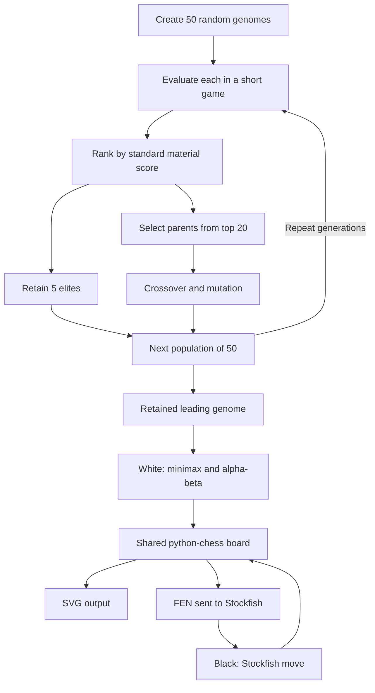

# Genetic-Chess-Algorithm
A Python machine learning project that is made to learn the optimal chess strategies. By using a previous Genetic Algorithm project to mutate and cross breed piece evaluations, this project spawns thousands of randomized neural profiles, competes against each other in automated matches.

<p>
  
  
  
  
</p>

I built Genetic Chess Algorithm as the next step after my [Genetic Algorithm](https://github.com/kadenyip/Genetic-Algorithm) project, which evolved random characters into a target phrase. I wanted to apply the same ideas—fitness, selection, elitism, crossover, and mutation—to a problem where a good decision depends on an opponent's response.

The result is a Python chess experiment that evolves five material weights and uses them inside a minimax search with alpha-beta pruning. It connects legal move generation, position evaluation, evolutionary optimization, SVG board rendering, opening-book access, and a Stockfish opponent.

The most valuable part of building it was discovering where an apparently reasonable objective failed: gaining material did not necessarily lead to checkmate, a high fitness score could come from a lucky opponent, and a deeper search could multiply training time. Those problems shaped the implementation and the next experiments.

**Current status:** a working development prototype with an evolutionary training loop and an automated Stockfish demonstration. Training still uses short games against random Black moves. The code has remaining evaluation and game-loop issues documented below; playing strength and speed improvements have not been established through a reproducible benchmark.

## Contents

- [From the original project to chess](#from-the-original-project-to-chess)
- [What the project implements](#what-the-project-implements)
- [Run the project](#run-the-project)
- [Architecture](#architecture)
- [How evolution and search work](#how-evolution-and-search-work)
- [Challenges, solutions, and lessons](#challenges-solutions-and-lessons)
- [Observations and current limitations](#observations-and-current-limitations)
- [Next steps](#next-steps)

## From the original project to chess

My first genetic algorithm had a precise target: a string. A character either matched its target position or it did not. Chess introduced delayed consequences, competing decisions, and an imperfect way to measure success.

| Design choice | Original phrase project | Genetic Chess Algorithm |
| :--- | :--- | :--- |
| Genome | A string of characters | Five floating-point piece values |
| Fitness | Correct characters at matching positions | White's material advantage after a simulated game |
| Candidate evaluation | Compare a string with a known answer | Play a game using the candidate's evaluation weights |
| Crossover | Combine sections of two strings | Combine sections of two weight lists |
| Mutation | Replace individual characters | Adjust individual weights numerically |
| Elitism | Preserve the top 10% | Preserve the top 10% |
| Main challenge | Converge toward an explicit target | Design a useful objective under uncertainty |

The chess version preserves the evolutionary structure while adding adversarial search and an external engine integration. Only the five material weights evolve. Legal chess rules come from `python-chess`; terminal scores and the positional heuristic are programmed explicitly.

## What the project implements

- **Evolutionary optimization:** populations of 50 genomes, elite preservation, parent selection, crossover, and independent mutation of each weight.
- **Adversarial search:** recursive minimax with alpha-beta cutoffs and reversible board updates.
- **Position evaluation:** evolved material weights, explicit checkmate and draw scores, and a small bonus for an opposing king farther from the center.
- **Chess state management:** legal moves, SAN parsing, UCI move conversion, and FEN synchronization through `python-chess`.
- **External engine integration:** Stockfish move selection with configurable strength settings and position-analysis requests.
- **Opening-book support:** weighted Polyglot lookup with a random fallback when the position is absent from the book.
- **Visual feedback:** a generated `board.svg` updated after moves in the demonstration.
- **Separate entry points:** terminal-only training and training followed by an automated game.

## Run the project

Run commands from the project directory so relative paths such as `gm2001.bin` and `board.svg` resolve correctly.

### 1. Install the Python dependencies

Use a compatible Python 3 installation and a virtual environment. Development history includes Python 3.10; dependencies are currently unpinned, so this is not a guaranteed compatibility matrix.

```bash
python -m venv .venv
```

Activate it on Windows PowerShell:

```powershell
.\.venv\Scripts\Activate.ps1
```

Or on macOS/Linux:

```bash
source .venv/bin/activate
```

Install the packages:

```bash
python -m pip install python-chess stockfish
```

### 2. Run training only

```bash
python genetic_visuals.py
```

This creates a population and prints a candidate's fitness and weights after each generation. It does not start the external Stockfish executable or render a game. Training can take substantial time because fitness evaluation repeatedly searches game trees.

### 3. Configure Stockfish for the demonstration

Install and extract the executable for your operating system from the [official Stockfish downloads](https://stockfishchess.org/download/). The Python package is a wrapper; the engine executable is a separate dependency. See the [wrapper's setup documentation](https://github.com/zhelyabuzhsky/stockfish).

In `chess_logic.py`, replace the machine-specific path in the `Stockfish(...)` constructor with the actual executable path on your computer:

```python
engine = Stockfish(path=r"C:\path\to\stockfish.exe")
```

That path is an example to replace. macOS and Linux require their corresponding executable and path. The current module starts Stockfish during import, so an invalid path prevents the demonstration from starting.

### 4. Train and watch the automated game

```bash
python chess_visuals.py
```

The script trains a population, selects its retained leading genome, resets the board, and plays that genome as White against Stockfish as Black. Open `board.svg` in a browser or an SVG preview to inspect the latest position. The file is overwritten after moves; a browser may need refreshing.

The current terminal banner still says “Most common openings,” but the active game loop calls `play_stockfish_move()`. The default requested Stockfish strength is `1320`; supported values depend on the installed engine. This setting is not a measured rating for this project.

During the demonstration game, `Ctrl+C` is caught and prints an abort message. The training loop does not have that same handler. Draw termination also needs improvement; see [current limitations](#observations-and-current-limitations).

## Architecture

```text
genetic_algorithm.py   Genome operations, fitness, minimax, and evaluation
genetic_visuals.py     Training-only terminal entry point
chess_logic.py         Shared game board, move helpers, SVG, book, and Stockfish
chess_visuals.py       Training followed by a genome-versus-Stockfish game
gm2001.bin            Polyglot opening-book data
board.svg             Latest rendered demonstration position
```



Training uses a fresh local board inside `calculate_fitness()`. The visible demonstration uses the shared board in `chess_logic.py`. This keeps simulated training moves separate from the board rendered for the demonstration.

| Component | Main functions | Responsibility |
| :--- | :--- | :--- |
| Evolution | `random_genome`, `crossover`, `mutate`, `evolve` | Create and reproduce candidate weights |
| Fitness | `calculate_fitness` | Simulate a short game and return standard material advantage |
| Search | `choose_move`, `minimax` | Compare legal continuations from a fixed player's perspective |
| Evaluation | `get_material_score`, `evaluate_board` | Score material, terminal outcomes, and king position |
| Game integration | `make_move`, `play_genetic_algorithm`, `play_stockfish_move` | Apply moves and update the visible board |
| External analysis | `get_current_evaluation` | Synchronize Stockfish and format its evaluation |
| Book opponent | `get_opponent_move`, `play_opponent_move` | Select a book move or use the random fallback |

## How evolution and search work

### The genome

Each genome is a list in this fixed order:

```python
[pawn_value, knight_value, bishop_value, rook_value, queen_value]
```

Initialization samples each value uniformly between `0.5` and `10.0`, rounded to two decimal places. Kings are excluded from the material list. Checkmate is represented separately in the search evaluator.

For a chosen side, material evaluation is:

```text
material score = sum of own piece weights - sum of opponent piece weights
```

Three different scores serve different purposes:

| Score | Uses | Purpose |
| :--- | :--- | :--- |
| Search evaluation | Candidate genome, terminal rules, king-position bonus | Choose a move |
| Genetic fitness | Fixed values `[1, 3, 3, 5, 9]` | Rank candidate genomes after simulated games |
| Stockfish evaluation | External engine output | Display analysis during the demonstration |

Using fixed weights for fitness prevents a candidate from directly increasing its grade by inflating its own values. However, this objective already includes conventional piece values, and it rewards final material balance rather than game results. The experiment is not an independent discovery of universal chess values.

### One generation

1. Play one fitness game for each of the 50 genomes.
2. Sort the population by fitness, highest first.
3. Carry the best five genomes forward unchanged.
4. Select two parents independently from the top 20 candidates.
5. Split at index 1, 2, or 3 and combine the beginning of one parent with the end of the other.
6. Give each child weight a 10% chance of changing by a random amount between `-1.0` and `+1.0`.
7. Round changed weights and enforce a minimum of `0.1`.
8. Repeat reproduction until the population contains 50 genomes.

Mutation creates values that crossover alone cannot introduce. Its probability applies to each weight separately: the probability of at least one mutation attempt across five weights is `1 - 0.9^5`, approximately 41%. Rounding or clamping can leave a selected value unchanged.

### Current configuration

| Setting | Current value | Location or behavior |
| :--- | :--- | :--- |
| Population size | 50 | `genetic_algorithm.py` |
| Generations | 4 | `genetic_algorithm.py`; earlier experiments used 20 |
| Mutation probability | 0.1 per weight | `mutate()` |
| Mutation magnitude | Uniformly sampled from -1 to +1 | No upper weight clamp after initialization |
| Elite fraction | 10%, or five genomes | `evolve()` |
| Parent pool | Top 20 genomes | Fixed slice in `evolve()` |
| Fitness games | One per candidate evaluation | Fresh random Black opponent each time |
| Fitness duration | Up to 20 move pairs / 40 plies | May end earlier |
| Training color | White | Fixed in `calculate_fitness()` |
| Training search depth | 3 plies | Default argument of `choose_move()` |
| Demonstration search depth | 2 plies | Explicit argument in `play_genetic_algorithm()` |
| Stockfish strength request | 1320 | Default `elo` argument |

The training banner in `chess_visuals.py` says depth 2, but fitness calls use the default depth 3. The function calls above describe the actual configuration.

### Minimax and alpha-beta pruning

The original move selector scored only the position immediately after its own move. The current selector temporarily applies each legal move, explores replies recursively, and undoes the move before considering the next candidate.

The maximizing level seeks the largest evaluation for the genome's side. The minimizing level assumes the opponent chooses the smallest evaluation for that same side. At depth zero or a terminal position, the search calls `evaluate_board()`.

For example, a capture can appear to gain one pawn immediately. At depth two, the search can also see an opponent's recapture that loses a more valuable piece. Depth three includes the genome's next reply. Search depth counts **plies**, so depth two represents one White move and one Black move.

Alpha-beta pruning maintains bounds on the useful scores remaining in a branch. When `beta <= alpha`, further exploration of that branch cannot improve the relevant decision, so the loop stops. Correct pruning preserves the minimax result for the searched tree while avoiding some work.

With branching factor `b` and depth `d`, plain minimax has roughly `O(b^d)` work. For illustration, a constant branching factor of 30 gives 900 leaves at depth two and 27,000 at depth three. These are illustrative counts, not measured node totals or timing predictions. Pruning effectiveness depends on the positions and move order.

The implementation currently uses the library's move order and starts fresh alpha-beta bounds for each root candidate. Explicit move ordering, shared root bounds, and caching remain opportunities for improvement.

## Challenges, solutions, and lessons

### 1. Short games rewarded a narrow objective

**Problem:** early training produced unusual values, including a bishop valued above a queen. A short material-based simulation does not adequately measure long-term planning, endgame conversion, or general playing strength.

**What I learned:** a genetic algorithm follows the objective supplied to it. A candidate can score well in the training environment without performing well in a full game against a stronger opponent. Unusual weights alone do not prove overfitting or show that queens were ignored; that requires comparison on other positions and opponents.

**Current response:** I added deeper search and an external opponent to inspect behavior beyond the original simulation. The training horizon and material-only fitness remain unchanged. Longer games, varied starting positions, and result-based scoring are next steps.

### 2. Greedy captures missed the opponent's reply

**Problem:** the original one-ply evaluator could prefer a capture without considering an immediate recapture. Changing piece weights could not make consequences outside the search visible.

**Implemented solution:** recursive minimax now alternates between maximizing and minimizing moves. Every speculative `board.push()` is followed by `board.pop()` on normal execution, restoring the parent position before another branch is searched.

**Lesson:** evaluation and search solve different parts of the decision problem. Better weights need a search that exposes relevant consequences.

### 3. Search depth multiplied the cost of training

**Problem:** each genome evaluation requires many move searches, and each additional ply expands those searches. The development conversation records long waits, but the runs did not capture enough consistent settings to support a reliable speed comparison.

**Implemented solution:** alpha-beta pruning cuts off branches whose remaining values cannot affect the decision. Training and demonstration depth are also configurable through the search calls.

**Lesson:** profile the entire training workload. With the current defaults, four generations perform 200 ranking games plus four extra reporting games. At up to 20 White searches per game, that is up to 4,080 searches before the demonstration begins. A search-time estimate for one move is not a training-time estimate.

The custom search uses ordinary Python control flow and has no GPU implementation or multiprocessing. Opening it in Jupyter does not change that. Cloud performance would need measurement; a GPU allocation alone does not accelerate this code.

### 4. Random opponents made fitness noisy

**Problem:** a randomly moving opponent can offer valuable pieces by chance. One fortunate game can lift a weak candidate above a stronger one. The runner also calculates fitness again for the printed candidate, so the displayed number comes from a different game than the score used for sorting.

**Implemented progression:** I added a Polyglot opponent for structured opening play, then integrated Stockfish as the demonstration opponent after observing repeated wins against the book-based opponent.

**Remaining work:** those opponents are not wired into `calculate_fitness()`. Training still uses random Black moves. A more reliable comparison needs multiple games, both colors, controlled randomness, and an evaluation set separate from training.

### 5. An opening book did not provide a complete opponent

**Problem:** book coverage ends. In this project, `get_opponent_move()` chooses a weighted entry from `gm2001.bin` when one exists, then falls back to a random legal move if no entry is available.

**Implemented solution:** the active demonstration now calls Stockfish for Black's decisions throughout the game. The opening-book helper remains available for experiments. Its lookup behavior follows the [python-chess Polyglot API](https://python-chess.readthedocs.io/en/latest/polyglot.html).

**Lesson:** the opponent's fallback behavior changes what a win demonstrates. Beating the book-plus-random configuration is a useful development observation, but it does not establish grandmaster-level performance or a rating.

### 6. Material evaluation gave little direction in the endgame

**Problem:** many quiet moves leave material unchanged. The original evaluator could not distinguish useful progress toward mate from aimless movement. With a strict `score > best_score` comparison, equal scores normally retain the first best move encountered; ties are not automatically randomized.

**Implemented solution:** `evaluate_board()` checks checkmate first and returns `+99999` for a win or `-99999` for a loss. It returns zero for recognized draws or claimable draws, then evaluates material and opposing king position for other positions.

The positional term is:

```text
edge bonus = 0.1 × (abs(enemy king rank - 3.5)
                  + abs(enemy king file - 3.5))
```

This ranges from `0.1` on the four central squares to `0.7` in a corner. It offers a preference for some positions with equal material.

**Lesson:** this is an evaluation blind spot as well as a search-depth issue. The horizon effect specifically concerns consequences beyond the search cutoff. Explicit terminal scores help when mate is visible; a heuristic supplies a signal when it is not.

The heuristic remains limited. It is applied in every phase, has no material-advantage condition, and does not measure king mobility, attacking-piece coordination, or the friendly king's support. It can leave many moves tied and cannot guarantee a mating plan. Its fixed scale can also outweigh a sufficiently small evolved piece value.

### 7. FEN simplified synchronization with Stockfish

**Problem:** the Python board and the external engine each maintain position state. Translating or replaying move history adds opportunities for inconsistency, particularly when loading a custom position.

**Implemented solution:** before requesting analysis or a move, the integration sends the current position directly:

```python
engine.set_fen_position(board.fen())
```

FEN contains piece placement, side to move, castling rights, en passant target, halfmove clock, and fullmove number. SAN describes a move in context, while UCI move notation identifies origin, destination, and optional promotion. Each format has a different role. See the [python-chess core documentation](https://python-chess.readthedocs.io/en/latest/core.html).

**Lesson:** choose a representation that matches the integration boundary. FEN provides a position snapshot, but it does not preserve the full move history needed to establish repetition. No reconstruction-speed benchmark was recorded.

### 8. Library assumptions caused runtime errors

Two concrete integration failures were resolved during development:

| Failure | Cause | Implemented correction |
| :--- | :--- | :--- |
| `AttributeError` for `board.is_draw()` | Suggested code referenced a method the board API did not provide | Check checkmate first, then use `is_game_over()` and `can_claim_draw()` in the evaluator |
| `ValueError` for `UCI_LimitStrength` | The installed Stockfish wrapper expected a Boolean instead of the string `"true"` | Pass `True` in the parameter dictionary |

The engine also initially failed to start because an example executable path did not exist locally. Pointing the wrapper to the actual extracted Windows executable resolved that dependency boundary.

**Lesson:** follow the traceback to the failing API call and verify the installed dependency's contract. Suggested code and examples still need inspection. In particular, a claimable draw and an automatically ended game are different states; the current evaluator treats claimability as zero rather than modeling the choice to claim.

### 9. Small control-flow mistakes changed the algorithm

The development history also included several bugs whose impact was larger than their size:

| Symptom | Cause | Correction reflected in the current code |
| :--- | :--- | :--- |
| Move selection considered only one candidate | `return best_move` was inside the candidate loop | Return after examining the candidates |
| Population became `None` | `evolve()` omitted its return statement | Return `next_generation` after reproduction |
| Every weight mutated | Mutation rate was written as `50` while random values were below 1 | Use a probability such as the current `0.1` |
| Mutation failed to run | Misspelled `random` and inconsistent `mutation`/`mutate` names | Use consistent function and module names |
| Printed evaluation raised `NameError` | `score` had not been assigned | Store `get_current_evaluation()` before printing |
| Random move selection failed with no legal moves | Selection attempted on an empty list | Return `False` in `computer_move()` when the list is empty |

Earlier interactive versions also exposed turn-control mistakes: an invalid human move advanced execution, a computer move was outside the loop, and input ran in a read-only output panel. The development fixes used the move helper's success result to retry, corrected indentation, and ran input in a terminal. The current entry point is an automated match rather than that earlier human-input loop.

### 10. Visual output needed to follow committed moves

**Problem:** the visible board needed to reflect successfully applied moves during debugging.

**Implemented solution:** move helpers call `save_board_svg()` after updating the board. `make_move()` parses SAN, validates the move, updates the position, and then saves the image. The genome, book, and Stockfish play helpers also save after applying moves.

**Lesson:** placing rendering next to committed state changes makes the game easier to inspect. Search simulations do not render each speculative position. This is file-based visual feedback, not an interactive graphical interface or a guaranteed live browser refresh.

## Observations and current limitations

An early 20-generation run recorded this output in the development conversation:

```text
Gen 20 | Best Fitness: 9.00 | Weights [P, N, B, R, Q]: [1.13, 6.18, 8.53, 8.16, 6.83]
```

That `9.00` represents a standard material advantage in one short evaluation game. It is not a win rate, an Elo rating, or proof that the weights generalize. This historical run also used different settings from the current four-generation configuration.

I reported repeated wins against the opening-book opponent during development, which motivated the Stockfish integration. No saved match suite, game count, or controlled win-rate report accompanies that observation. The implemented accomplishments are the connected training and search pipeline, the stronger demonstration opponent, and the concrete debugging fixes described above.

The current source also exposes several specific limitations:

- **The reported champion is a retained parent.** `population[0]` is the highest-ranked genome from the preceding ranking pass. New offspring are not evaluated before reporting or final selection, so the last generation's children have not been compared with it.
- **Fitness and winning are different objectives.** Search recognizes checkmate, but `calculate_fitness()` still returns material even when a game ended in mate. It does not explicitly reward wins.
- **Draw handling is incomplete in the demonstration.** Its loop checks checkmate rather than every game-over condition. Stalemate can reach a move selector with no legal moves, and other draws may not stop play. The empty-list guard in the older random helper does not protect every move path.
- **Stockfish display scores need correction.** `get_current_evaluation()` returns `+100` immediately for any mate score, losing its sign. It also maps every negative raw centipawn score to `-100` before normal conversion and perspective handling. These displayed numbers should not be used as benchmark data.
- **The root score sentinel is too high for forced losses.** `choose_move()` starts at `-200`, while losing mate evaluates to `-99999`. If no move exceeds the sentinel, it falls back to a random move. Starting from negative infinity would allow it to rank all evaluated moves consistently.
- **Configuration and presentation have drifted.** Training and demonstration depths differ, and some printed labels describe the earlier opponent. Dependency versions, saved genomes, reproducible seeds, and a match-results store are absent.
- **The positional model is small.** It lacks phase-aware evaluation, piece-square tables, mobility, pawn structure, quiescence search, transposition caching, and mate-distance preferences.

These limitations define the next development work and the boundaries of the current results.

## Next steps

| Priority | Planned improvement | Evidence it should produce |
| :--- | :--- | :--- |
| 1 | Correct score conversion, terminal handling, and root initialization | Consistent scores and clean game endings on known positions |
| 2 | Evaluate the final population and retain the fitness records used for ranking | A champion selected from all evaluated candidates and honest reporting |
| 3 | Make configuration explicit and save seeds, genomes, and games | Repeatable runs with traceable settings |
| 4 | Average fitness over multiple opponents, both colors, and varied positions | Lower sensitivity to one lucky game |
| 5 | Add win/draw/loss rewards and longer or endgame-focused episodes | A closer relationship between selection and completed-game outcomes |
| 6 | Profile search and add move ordering, shared root bounds, and caching | Measured node counts and elapsed-time comparisons |
| 7 | Add quiescence search and phase-aware positional terms | Better handling of tactical cutoffs and quiet endgames |
| 8 | Compare evolved weights with standard and random weights under identical search settings | Evidence that evolution improves results beyond the search algorithm alone |

A useful benchmark would save the opponent version and settings, opening positions, colors, seeds, search limits, game outcomes, and timing. Separating training positions from evaluation positions would help determine whether improvements carry beyond the environment that selected the genomes.

## What this project taught me

This project connected evolutionary computation with recursive search, mutable state, external process integration, and practical debugging. The transition from phrase matching to chess made the objective function a central design decision: a program can optimize a score successfully while still behaving poorly at the task I intended.

It also taught me to distinguish an implemented feature from a measured improvement. Adding search, pruning, an engine opponent, or a positional heuristic creates something testable. Demonstrating that it improves play requires controlled comparisons and recorded results.

**Built by [Kaden Yip](https://github.com/kadenyip)** · Computer Engineering student at the University of Washington · [kyioma@uw.edu](mailto:kyioma@uw.edu)

**Related project:** [Genetic Algorithm — Target Word Evolution](https://github.com/kadenyip/Genetic-Algorithm)
